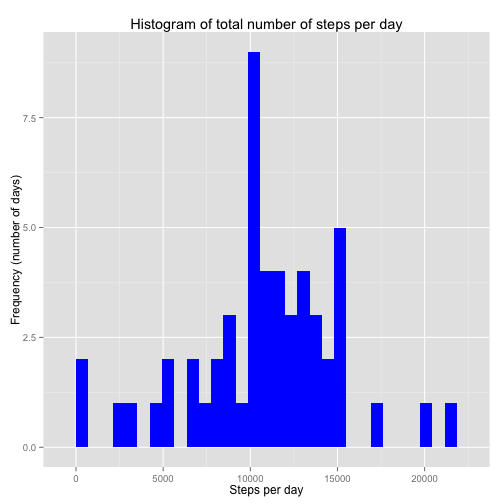
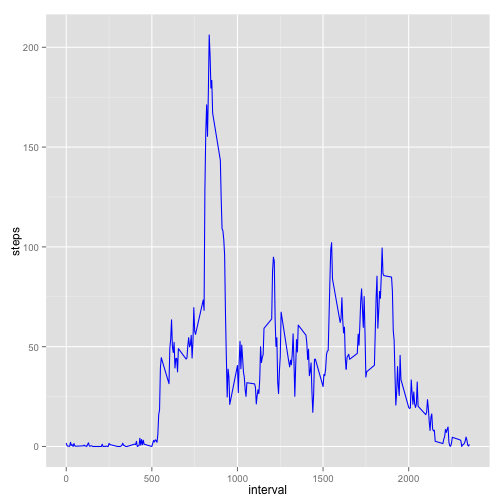
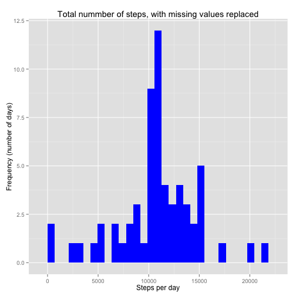
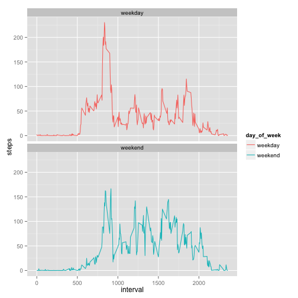

##Introduction  
It is now possible to collect a large amount of data about personal movement using activity monitoring devices such as a Fitbit, Nike Fuelband, or Jawbone Up. These type of devices are part of the “quantified self” movement – a group of enthusiasts who take measurements about themselves regularly to improve their health, to find patterns in their behavior, or because they are tech geeks. But these data remain under-utilized both because the raw data are hard to obtain and there is a lack of statistical methods and software for processing and interpreting the data.

This assignment makes use of data from a personal activity monitoring device. This device collects data at 5 minute intervals through out the day. The data consists of two months of data from an anonymous individual collected during the months of October and November, 2012 and include the number of steps taken in 5 minute intervals each day.

##Available data  
The data for this assignment can be downloaded from the course web site:

* Dataset: Activity monitoring data [52K]
The variables included in this dataset are:

* **steps**: Number of steps taking in a 5-minute interval (missing values are coded as 𝙽𝙰)
* **date**: The date on which the measurement was taken in YYYY-MM-DD format  
* **interval**: Identifier for the 5-minute interval in which measurement was taken.
The dataset is stored in a comma-separated-value (CSV) file and there are a total of 17,568 observations in this dataset. 

##Loading and preprocessing the data  
The dataset to be used is available at the following [link](https://d396qusza40orc.cloudfront.net/repdata%2Fdata%2Factivity.zip)  


```r
library(knitr)
library(dplyr)
library(lubridate)
library(ggplot2)
```
set the global option to echo the code  

```r
opts_chunk$set(echo=TRUE)
```
loading and preprocessing  


```r
data<-read.csv("activity.csv",header=TRUE,sep=",",colClasses=c("numeric","character","integer"))
data$date<-ymd(data$date)
```
##What is mean total number of steps taken per day?  

###1.Calculate the total number of steps taken per day  

```r
total_steps<-data %>%
      filter(!is.na(steps)) %>%
      group_by(date) %>%
      summarize(steps_per_day=sum(steps)) %>%
      print
```

```
## Source: local data frame [53 x 2]
## 
##          date steps_per_day
## 1  2012-10-02           126
## 2  2012-10-03         11352
## 3  2012-10-04         12116
## 4  2012-10-05         13294
## 5  2012-10-06         15420
## 6  2012-10-07         11015
## 7  2012-10-09         12811
## 8  2012-10-10          9900
## 9  2012-10-11         10304
## 10 2012-10-12         17382
## ..        ...           ...
```
###2.Create a histogram displaying the total number of steps taken per day  


```r
p<-ggplot(total_steps,aes(steps_per_day))+
      geom_histogram(fill="blue")+
      labs(title="Histogram of total number of steps per day",x="Steps per day",y="Frequency (number of days)")
 print(p)         
```

```
## stat_bin: binwidth defaulted to range/30. Use 'binwidth = x' to adjust this.
```

 

###3.Calculate the mean and median of the total number of steps taken per day


```r
 mean_total_steps<-mean(total_steps$steps_per_day,na.rm=TRUE)
 median_total_steps<-median(total_steps$steps_per_day,na.rm=TRUE)
 mean_total_steps
```

```
## [1] 10766.19
```

```r
 median_total_steps
```

```
## [1] 10765
```
 
##What is the average daily activity pattern? 

```r
 interval<-data%>%
       filter(!is.na(steps))%>%
       group_by(interval)%>%
       summarize(steps=mean(steps))%>%
       print
```

```
## Source: local data frame [288 x 2]
## 
##    interval     steps
## 1         0 1.7169811
## 2         5 0.3396226
## 3        10 0.1320755
## 4        15 0.1509434
## 5        20 0.0754717
## 6        25 2.0943396
## 7        30 0.5283019
## 8        35 0.8679245
## 9        40 0.0000000
## 10       45 1.4716981
## ..      ...       ...
```
###1.Make a time series plot (i.e. 𝚝𝚢𝚙𝚎 = "𝚕") of the 5-minute interval (x-axis) and the average number of steps taken, averaged across all days (y-axis)  

```r
ggplot(interval,aes(x=interval,y=steps))+
geom_line(color="blue")
```

 

###2.Which 5-minute interval, on average across all the days in the dataset, contains the maximum number of steps?

```r
interval[which.max(interval$steps),]
```

```
## Source: local data frame [1 x 2]
## 
##   interval    steps
## 1      835 206.1698
```
##Inputing missing values  

###1.Calculate and report the total number of missing values in the dataset (i.e. the total number of rows with 𝙽𝙰s)  

```r
 sum(is.na(data$steps))
```

```
## [1] 2304
```
###2.Devise a strategy for fill in all of the missing values in the dataset  
The missing values will be replaced by the mean for that 5-minute interval  


```r
full_data<-data
missing<-is.na(full_data$steps)
avg_internal<-tapply(full_data$steps,full_data$interval,mean,na.rm=TRUE)
full_data$steps[missing]<-avg_internal[as.character(full_data$interval[missing])]
```
###3.Create a new dataset that is equal to the original dataset but with the missing data filled in

We check that there are no more NAs

```r
sum(is.na(full_data$steps))
```

```
## [1] 0
```

###4.Make a histogram of the total number of steps taken each day and Calculate and report the mean and median total number of steps taken per day. Do these values differ from the estimates from the first part of the assignment? What is the impact of imputing missing data on the estimates of the total daily number of steps?  


```r
full_steps<-full_data%>%
      group_by(date)%>%
      summarize(steps=sum(steps))
```


```r
ggplot(full_steps,aes(x=steps))+
      geom_histogram(fill="blue")+
      labs(title="Total nummber of steps, with missing values replaced",x="Steps per day",y="Frequency (number of days)")
```

```
## stat_bin: binwidth defaulted to range/30. Use 'binwidth = x' to adjust this.
```

 

The new mean and midean steps are the following:

```r
mean_full_steps<-mean(full_steps$steps)
median_full_steps<-median(full_steps$steps)
```

```r
mean_full_steps
```

```
## [1] 10766.19
```

```r
median_full_steps
```

```
## [1] 10766.19
```
As we see, by replacing the missing values with the mean of the steps for the same 5-minute intervals results in the mean and median having the same value

##Are there differences in activity patterns between weekdays and weekends?  

###1.Create a new factor variable in the dataset with two levels- "weekday" and "weekend"  

```r
full_data<-mutate(full_data,day_of_week=ifelse(weekdays(full_data$date)=="Saturday"|weekdays(full_data$date)=="Sunday","weekend","weekday"))
full_data$day_of_week<-as.factor(full_data$day_of_week)
head(full_data)
```

```
##       steps       date interval day_of_week
## 1 1.7169811 2012-10-01        0     weekday
## 2 0.3396226 2012-10-01        5     weekday
## 3 0.1320755 2012-10-01       10     weekday
## 4 0.1509434 2012-10-01       15     weekday
## 5 0.0754717 2012-10-01       20     weekday
## 6 2.0943396 2012-10-01       25     weekday
```
###2.Make a panel plot containing a time series plot (i.e. 𝚝𝚢𝚙𝚎 = "𝚕") of the 5-minute interval (x-axis) and the average number of steps taken, averaged across all weekday days or weekend days (y-axis)  

```r
weekday_interval<-full_data%>%
      group_by(interval,day_of_week)%>%
      summarize(steps=mean(steps))
ggplot(weekday_interval,aes(x=interval,y=steps,color=day_of_week))+
      geom_line()+
      facet_wrap(~day_of_week,ncol=1,nrow=2)
```

 

What we can conclude from the plots is that on weekdays the activity begins earlier and it reaches its peak somewhere in the morning, while on weekends the activity begins later and it is more evenly distributed across the day.
